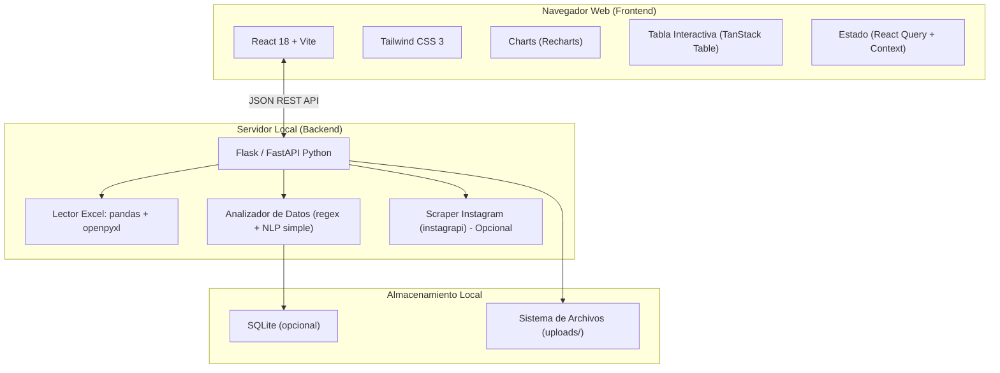
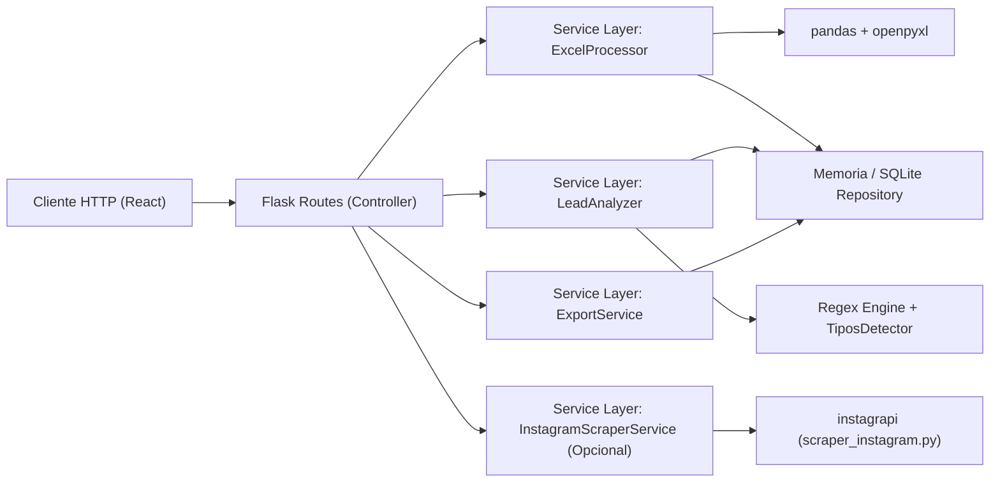
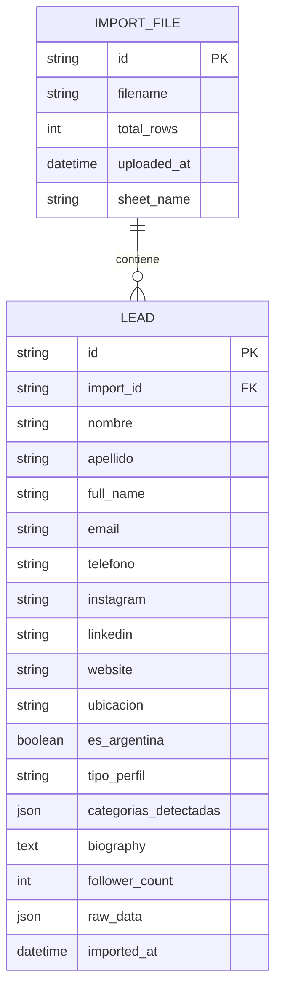

## 1. Diseño de Arquitectura

Arquitectura cliente-servidor simple, enfocada en ejecución local. El backend Python se encarga de la lectura de Excel y el análisis de datos; el frontend React gestiona la interfaz de usuario. Todo funciona en localhost sin dependencias de nube, manteniendo la privacidad de los datos de leads.



## 2. Descripción de Tecnologías

- **Frontend**: React 18 + Vite 5 + TypeScript. Rápido, moderno, con HMR.
- **Estilos**: Tailwind CSS 3 con tema custom (paleta oscura, glassmorphism).
- **Gráficos**: Recharts (ligero, nativo React, buen soporte de tooltip).
- **Tabla**: TanStack Table (anteriormente React Table) — filtros, sort, paginación, full-text search.
- **Drag & Drop**: react-dropzone o @uploadthing/react (simple).
- **Componentes UI**: Headless UI + componentes custom (sin librerías visuales genéricas).
- **HTTP Client**: Axios.
- **Rutas**: React Router DOM 6.
- **Iconos**: Phosphor React (estilo limpio).
- **Backend**: Flask 3 (más simple, menos boilerplate que FastAPI para este caso) con CORS habilitado.
- **Lectura Excel**: pandas + openpyxl. Soporte para .xlsx, .xls, .csv.
- **Análisis de datos**: Expresiones regulares para extraer emails, teléfonos, detectar ubicación Argentina.
- **Opcional: Scraper**: integración del scraper_instagram.py existente como módulo importable.
- **Persistencia**: Opcional SQLite + SQLAlchemy para almacenar sesiones/importaciones.
- **Testing local**: Sin BBDD externa; todo en memoria y archivos locales.

## 3. Definición de Rutas

| Ruta Frontend | Propósito |
|---------------|-----------|
| `/` | Dashboard principal con métricas y resumen |
| `/upload` | Subida y preview de archivos Excel |
| `/explorer` | Vista de tabla interactiva con filtros |
| `/explorer/:id` | Perfil detallado de un lead individual |
| `/analysis` | Panel de análisis inteligente y exportación |
| `/scraper` | (Opcional) Panel para ejecutar el scraper Instagram |

## 4. Definición de API (Backend Flask)

```typescript
// ===== Tipos compartidos =====
interface Lead {
  id: string;                // UUID generado al importar
  source_file: string;       // nombre de archivo origen
  raw_data: Record<string, any>; // fila original sin procesar
  nombre?: string;
  apellido?: string;
  full_name?: string;
  email?: string;
  telefono?: string;
  instagram?: string;
  linkedin?: string;
  website?: string;
  ubicacion?: string;
  es_argentina: boolean;
  tipo_perfil?: string;      // "abogado" | "estudio_juridico" | "contador" | "otro"
  categorias_detectadas: string[];
  biography?: string;
  follower_count?: number;
  imported_at: string;       // ISO date
}

interface FileImportResult {
  file_id: string;
  filename: string;
  total_rows: number;
  columns_detected: string[];
  leads: Lead[];
  preview_rows: Lead[];      // primeras 5
}

interface DashboardStats {
  total_leads: number;
  argentina_count: number;
  por_tipo: Record<string, number>;
  por_ubicacion: Record<string, number>;
  emails_count: number;
  telefonos_count: number;
  instagram_count: number;
}
```

### Endpoints REST

| Método | Ruta | Descripción | Body / Query | Respuesta |
|--------|------|-------------|--------------|-----------|
| POST | `/api/upload` | Subir archivo Excel, procesar y devolver preview | `multipart/form-data` con `file` + `sheet_name?` | `FileImportResult` |
| GET | `/api/files` | Listar archivos importados | - | `{ files: FileInfo[] }` |
| GET | `/api/leads` | Obtener leads paginados y filtrados | `?page=&size=&search=&argentina_only=&tipo=&ubicacion=` | `{ data: Lead[], total: number, page: number }` |
| GET | `/api/leads/:id` | Perfil detallado de un lead | - | `Lead` + análisis extra |
| GET | `/api/dashboard/stats` | Estadísticas del dashboard | `?file_id?` (opcional filtrar por archivo) | `DashboardStats` |
| POST | `/api/leads/export` | Exportar leads filtrados | `{ format: "xlsx" \| "csv" \| "json", filters: {} }` | Blob / archivo descargable |
| GET | `/api/columns/suggest` | Sugerir mapeo de columnas | `?columns=` (lista de nombres) | `{ mapping: Record<columna_campo, campo_estandar> }` |
| POST | `/api/scraper/run` | (Opcional) Ejecutar scraper y agregar leads | `{ keywords: [], count: 20 }` | `{ new_leads: Lead[] }` |

## 5. Diagrama de Arquitectura del Servidor



## 6. Modelo de Datos

### 6.1 Definición del Modelo (ER)



### 6.2 SQL DDL (SQLite - Opcional)

```sql
-- Tabla de archivos importados
CREATE TABLE IF NOT EXISTS import_files (
    id TEXT PRIMARY KEY,
    filename TEXT NOT NULL,
    sheet_name TEXT,
    total_rows INTEGER DEFAULT 0,
    uploaded_at DATETIME DEFAULT CURRENT_TIMESTAMP
);

-- Tabla de leads
CREATE TABLE IF NOT EXISTS leads (
    id TEXT PRIMARY KEY,
    import_id TEXT REFERENCES import_files(id) ON DELETE CASCADE,
    nombre TEXT,
    apellido TEXT,
    full_name TEXT,
    email TEXT,
    telefono TEXT,
    instagram TEXT,
    linkedin TEXT,
    website TEXT,
    ubicacion TEXT,
    es_argentina INTEGER DEFAULT 0,
    tipo_perfil TEXT,
    categorias_detectadas TEXT,
    biography TEXT,
    follower_count INTEGER,
    raw_data TEXT,
    imported_at DATETIME DEFAULT CURRENT_TIMESTAMP
);

-- Índices para búsquedas rápidas
CREATE INDEX idx_leads_argentina ON leads(es_argentina);
CREATE INDEX idx_leads_tipo ON leads(tipo_perfil);
CREATE INDEX idx_leads_email ON leads(email);
CREATE INDEX idx_leads_import ON leads(import_id);
```

## 7. Notas de Implementación

- **Privacidad**: Los archivos NO se suben a ningún servicio externo. Todo queda en la carpeta `uploads/` del proyecto.
- **Perf**: Para archivos >10k filas, paginación server-side con offset/limit. Frontend no carga todos los datos a la vez.
- **Encoding**: Archivos CSV leídos con `encoding='utf-8-sig'` + detección de encoding con `chardet` si falla.
- **Análisis Argentina**: Detectar provincias en nombre/ubicacion/bio (ver lista `ARGENTINA_LOCATIONS` existente).
- **Extracción emails/teléfonos**: Regex robustos que soporten formatos internacionales argentinos (+54, 11, etc.).
- **Persistencia opcional**: Primera versión puede correr 100% en memoria sin SQLite; se agrega como mejora si el usuario quiere.
