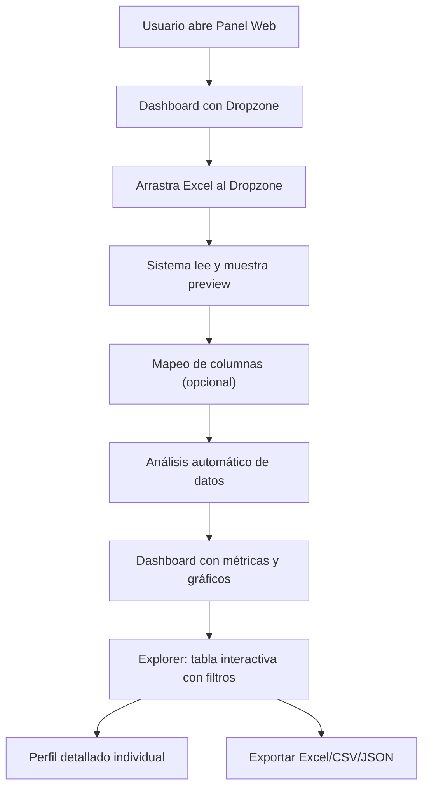

## 1. Resumen del Producto

Panel web profesional para gestionar listas de contactos de Argentina mediante carga de archivos Excel. El sistema analiza, organiza y visualiza la información de leads en una interfaz intuitiva y moderna, resolviendo la necesidad de centralizar y explorar datos de potenciales clientes (estudios jurídicos, abogados, profesionales, etc.).

- **Propósito principal**: Transformar archivos Excel de contactos en dashboards interactivos con análisis automático y visualización clara.
- **Usuarios objetivo**: Empresas, profesionales de ventas y marketing que gestionan bases de datos de leads argentinos.
- **Valor diferencial**: Análisis inteligente de datos más visualización elegante + integración opcional con scraper de Instagram.

## 2. Características Principales

### 2.1 Roles de Usuario
No hay distinción de roles en la primera versión: es una herramienta de uso local/individual.

### 2.2 Módulos Funcionales
1. **Panel de Inicio (Dashboard)**: Resumen estadístico, tarjetas métricas, gráficos.
2. **Gestor de Archivos**: Drag & drop para cargar Excel, lista de archivos cargados.
3. **Vista de Datos (Data Explorer)**: Tabla interactiva con filtros, búsqueda, paginación.
4. **Análisis Automático**: Detección de columnas, categorización, estadísticas, perfiles completos.
5. **Vista de Perfil Individual**: Tarjeta detallada con toda la información por contacto.
6. **Opcional: Integración Scraper Instagram**: Ejecutar scraper desde el panel y fusionar datos.

### 2.3 Detalle de Páginas
| Nombre de Página | Nombre de Módulo | Descripción de Funcionalidad |
|------------------|------------------|-------------------------------|
| Dashboard | Hero + Métricas | Cantidad total de leads, origen, categorías, top ubicaciones argentinas. |
| Dashboard | Gráficos Interactivos | Distribución geográfica, tipos de perfil, distribución de followers. |
| Subir Archivos | Dropzone | Área drag & drop + selector manual; preview previo a importar. |
| Subir Archivos | Mapeo de Columnas | Asistente para vincular columnas del Excel a campos estándar (nombre, email, Instagram, etc.). |
| Explorer | Tabla Interactiva | Tabla paginada con sort, filtros globales y por columna, búsqueda full-text. |
| Explorer | Perfil Detallado | Modal/página con toda la info del lead en formato tarjeta elegante. |
| Análisis | Panel Inteligente | Detección automática: Argentina Sí/No, tipo de perfil, emails extraídos, teléfonos. |
| Análisis | Exportación | Descargar datos filtrados en Excel/CSV/JSON. |

## 3. Flujo Principal

1. El usuario abre la aplicación web y ve el Dashboard vacío con opción de subir archivo.
2. Arrastra un Excel (.xlsx/.xls/.csv) al Dropzone o lo selecciona manualmente.
3. El sistema lee el archivo, muestra preview de columnas y primeras filas.
4. (Opcional) El usuario mapea columnas del Excel a campos predefinidos.
5. El sistema procesa y analiza los datos: detecta ubicación Argentina, extrae emails/teléfonos, clasifica perfiles.
6. El Dashboard se actualiza con métricas y gráficos.
7. El usuario navega al Explorer para ver, filtrar y buscar contactos.
8. Puede abrir el perfil detallado de cualquier contacto.
9. Puede exportar los resultados filtrados.

## 4. Diseño de Interfaz de Usuario

### 4.1 Estilo de Diseño
- **Temática**: Estilo ejecutivo/lujo con acentos vibrantes (profesional pero moderno, no "corporativo aburrido"). Inspirado en paneles de SaaS premium como Linear + Notion.
- **Colores**: 
  - Primario: Azul profundo elegante (#1e3a8a) + acento Turquesa neón (#06b6d4)
  - Secundario: Vino tinto oscuro (#7f1d1d) + detalle Dorado mate (#d97706)
  - Fondo: Gradiente sutil de grafito frío (casi negro #0f172a) a azul noche (#1e293b) — modo oscuro por defecto
- **Botones**: Redondeados (radius 10px), con sombra suave, efecto hover con elevación + transición, bordes brillantes en acento.
- **Tipografía**: Display = "Space Grotesk" (elegante geométrico) + Cuerpo = "Inter" pero con tracking ajustado.
- **Layout**: Sidebar fija a la izquierda + panel principal a la derecha. Tarjetas con bordes semi-transparentes (glassmorphism suave), sombras difusas.
- **Iconos**: Remix Icon o Phosphor Icons (estilo limpio, outline con fill en acento).
- **Texturas**: Muy sutil capa de "grain" (ruido) en el fondo para dar profundidad. Gradientes radiales suaves en puntos clave.

### 4.2 Resumen de Diseño por Página
| Nombre de Página | Nombre de Módulo | Elementos UI |
|------------------|------------------|-------------|
| Dashboard | Hero + Métricas | 4 tarjetas grandes con contador animado + icono gigante de acento. Fondo con blur radial. Animación stagger de entrada. |
| Dashboard | Gráficos | Gráfico de barras (ubicaciones), pie chart (tipos de perfil), line chart opcional. Tooltips elegantes. |
| Subir Archivos | Dropzone | Recuadro gigante con borde punteado animado, icono de nube grande, texto guía. Cuando arrastran: borde sólido + efecto glow. |
| Subir Archivos | Preview | Tabla mini con primeras 5 filas, selector de hoja Excel, selector de columna mapeo tipo "tag". |
| Explorer | Tabla | Cabecera fija con sticky, filas con efecto hover (desplazamiento sutil), fila expandible para ver bio completa. |
| Explorer | Perfil Modal | Modal grande con fondo glassmorphism, foto de perfil redonda con borde brillante, grid de campos, tags de categoría. |
| Perfil | Tarjeta | Timeline-style layout con secciones (Contacto, Redes, Datos Profesionales, Bio). Badges de verificación. |

### 4.3 Responsividad
- Desktop-first. Punto de quiebre principal en 1024px.
- Tablet (768px): sidebar colapsable a íconos, gráficos adaptan tamaño, tabla se vuelve scroll horizontal.
- Mobile (<640px): sidebar desaparece y pasa a drawer inferior/hamburguesa. Dropzone ocupa ancho completo. Tarjetas se apilan verticalmente. Tabla en móvil: tarjetas expandibles por fila.
- Optimizado para touch: targets >= 44px, scroll suave, sin efectos hover en mobile.

### 4.4 Animaciones Destacadas
- **Entrada al panel**: Staggered fade-up para todas las tarjetas del dashboard (delay 0ms, 50ms, 100ms, 150ms...)
- **Dropzone hover**: Brillo pulsante suave + scale(1.01)
- **Contadores numéricos**: Animación tipo "odometer" de 0 al valor final en 1.2s
- **Gráficos**: Barras que crecen desde 0 con easing "out-expo"
- **Cambio de página**: Transición de slide lateral o fade (opacity 0→1 con translate-y 10px→0)
- **Perfil detallado**: Modal con scale(0.95) + opacity → 1 con bounce-back
